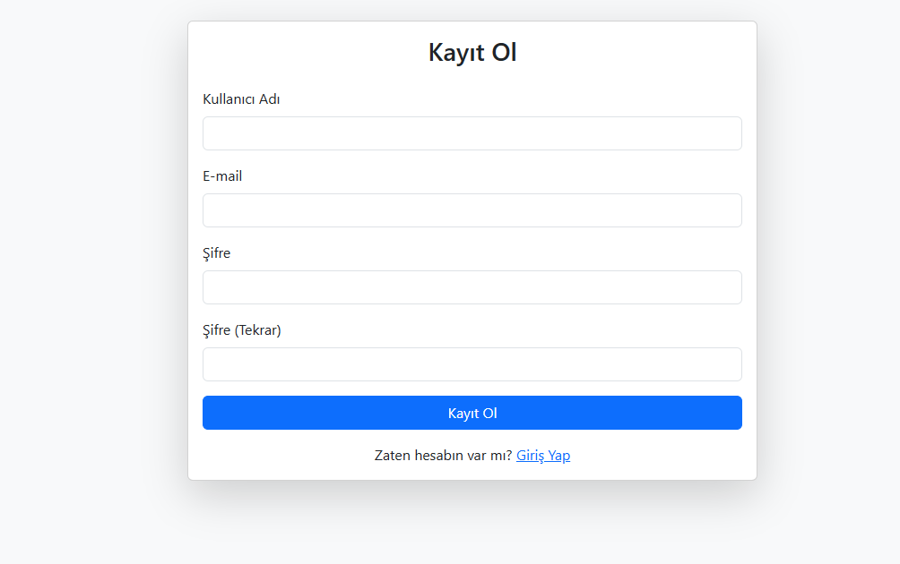
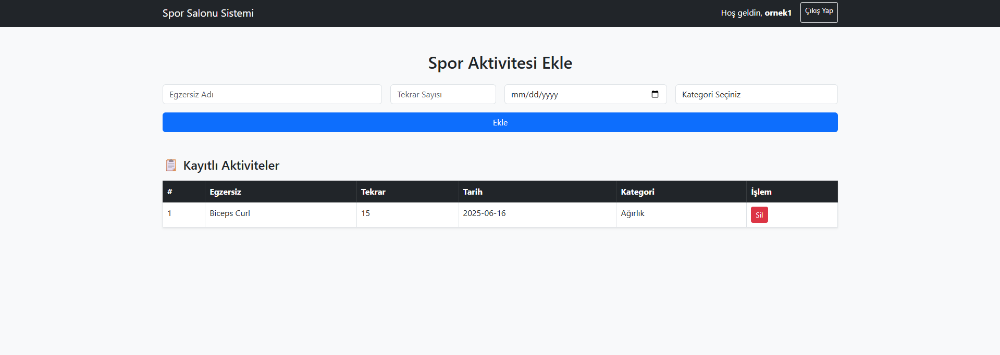

# Antreman Yonetim-Sistemi

PHP, MySQL, HTML ve Bootstrap kullanılarak geliştirilen bir **Spor Salonu Yönetim Sistemi** uygulamasıdır. Kullanıcılar kayıt olabilir, giriş yapabilir ve kendi spor aktivitelerini sisteme kaydedebilir.

## Video
Uygulama kullanım videosu için ----> https://youtu.be/y3Urm8WKn7g

##  Özellikler

-  Kullanıcı Kaydı (şifre hash'li olarak)
-  Giriş / Çıkış (Session tabanlı oturum kontrolü)
-  Aktivite Ekleme (Egzersiz adı, tekrar sayısı, tarih)
-  Kayıtlı Aktiviteleri Listeleme
-  Aktivite Silme
-  Bootstrap ile responsive kullanıcı arayüzü
-  Güvenlik için PDO + Hazırlanmış SQL ifadeleri

---

## 🛠 Kullanılan Teknolojiler

| Katman     | Teknoloji         |
|------------|-------------------|
| Frontend   | HTML, Bootstrap 5 |
| Backend    | PHP (pure/yalın)  |
| Veritabanı | MySQL             |
| Güvenlik   | `password_hash`, `session`, PDO |

---

##  Klasör Yapısı

spor_sistemi/

├── config/
│ └── db.php # Veritabanı bağlantısı

├── index.php # Giriş ekranı

├── register.php # Kayıt olma sayfası

├── login.php # Giriş işlemleri

├── logout.php # Çıkış işlemi

├── dashboard.php # Kullanıcı paneli

├── delete.php # Aktivite silme

├── README.md # Proje tanıtımı

## Ekran Görüntüleri 

## Güvenlik Notları
Şifreler password_hash() ile hash’lenir, password_verify() ile kontrol edilir.

PDO kullanılarak SQL Injection’a karşı koruma sağlanmıştır.

Oturumlar $_SESSION ile yönetilir, düz cookie kullanılmaz.

## Geliştirici
Bu proje Bursa Teknik Üniversitesi Bilgisayar Mühendisliği dersi kapsamında hazırlanmıştır.

Geliştirici: [Abdullah Çelik]

 Ders: Web Tabanlı Programlama

